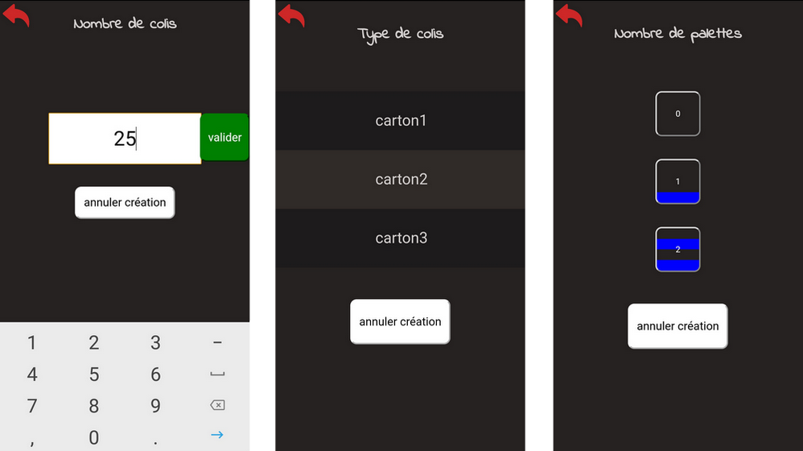
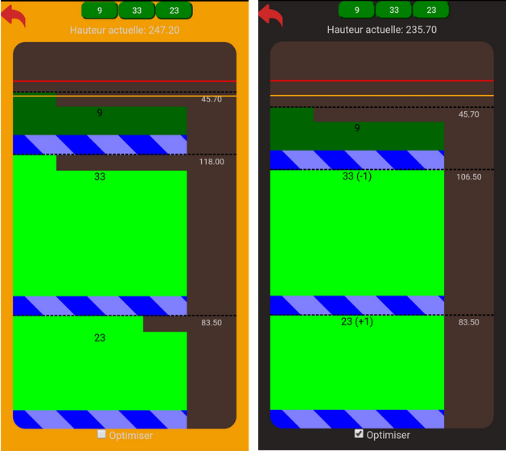

# Master Cercleur
Master Cercleur est une application pour optimiser le gerbage (empilement) des palettes.

## Interface
Composée de larges boutons, l'interface doit montrer rapidement l'inventaire des commandes saisies par l'utilisateur.

L'utilisateur peut modifier en paramètres les longueurs, largeurs et hauteurs des différents cartons ainsi que de la palette.

## Affichage des résultats

L'utilisateur choisit ensuite les palettes qu'il souhaite superposer. Si cela dépasse la hauteur "dangereuse" (modifiable dans les paramètres), le programme clignote orange. Si les palettes superposées dépassent la hauteur maximum autorisé (toujours modifiable dans les paramètres), le programme clignotera rouge.

Si plus de deux palettes sont superposées, l'utilisateur peut choisir d'"optimiser" l'agencement en cochant la case "optimiser".
A ce moment le programme mélange les commandes avec les mêmes types de colis pour gagner des rangs de hauteur.

Si après cela, la hauteur dépasse encore la hauteur maximale autorisée, tous les "restes" de commande (rang non plein) sont récupérés puis placés sur une unique palette par dessus le reste.

